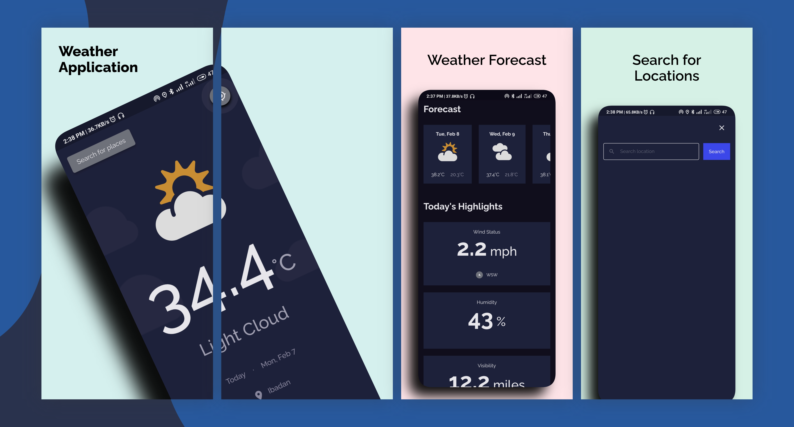

# Weather App - Made With Flutter :blue_heart: #
A simple weather app that displays weather conditions.

   
 
This application is made with **Flutter** framework to provide weather details for a specified location.
**The release apk is available under the release tags. It's also available on this drive link - [Weather APK]**

## Demo

## :sparkles: App Features

- Get Current Weather Data
- 5-days Weather Forecast
- Get Weather from GPS Current Location
- Search for Locations and Display Weather Data

## :wrench: Technical Features

<table>
    <tr>
        <td><a href="https://pub.dev/packages/hooks_riverpod">Hooks Riverpod</a> Combination of Riverpod and Flutter Hooks for State Management</td>
        <td><a href="https://pub.dev/packages/dio">Dio</a> For Handling Network Requests</td>
    </tr>
    <tr>
        <td><a href="https://pub.dev/packages/freezed">Freezed</a> For Handling Network Exceptions</td>
        <td><a href="https://pub.dev/packages/shared_preferences">Shared Preference</a> For Local Storage</td>
    </tr>
</table>

## :iphone: Screens
:art: The UI is inspired by this [Figma file]

## ⭐ Future Features
*Feel free to fork and contribute new features.* ❤︎

## 🚀 Technologies

- [Flutter v2.5.1]
- Dart v2.14.4

## 🤝 Contribute

To contribute, fork the repository and push the changes to the **master** branch. Then submit a pull request for merging with the source. If your code passes the review and checks it will be merged into the master branch.

## 💬 Feedback

Feel free to send us feedback on [Twitter] or [file an issue]. Feature requests are always welcome.

## 📝 License

Licensed under the [MIT License].

[//]: # (These are reference links used in the body of this note and get stripped out when the markdown processor does its job. There is no need to format nicely because it shouldn't be seen. Thanks SO - http://stackoverflow.com/questions/4823468/store-comments-in-markdown-syntax)

[GitHub issues]: <https://img.shields.io/github/issues/iloveteajay_/weather?color=red>
[GitHub stars]: <https://img.shields.io/github/stars/iloveteajay_/weather?color=orange>
[GitHub release]: <https://img.shields.io/github/release/iloveteajay_/weather?color=blue>
[Generate Updated Goldens]: <https://github.com/iloveteajay_/weather/actions/workflows/PR-generate-goldens.yaml/badge.svg>
[Pull Request Labeler]: <https://github.com/iloveteajay_/weather/actions/workflows/label.yaml/badge.svg>
[Test PR and Push]: <https://github.com/iloveteajay_/weather/actions/workflows/PR-open-test-build.yaml/badge.svg>
[Build Release APK]: <https://github.com/iloveteajay_/weather/actions/workflows/PR-merge-build-release.yaml/badge.svg>
[codecov]: <https://codecov.io/gh/iloveteajay_/weather/branch/master/graph/badge.svg?token=1AL3LTIQE7>
[Figma file]: <https://www.figma.com/file/5X3Ao3gEqZPqqKctP7riDF/weather-app?node-id=1%3A256>
[Weather APK]: <https://drive.google.com/folderview?id=1v7iHxgygzObno7DKGU2FFc2__NS0nZ2->
[Flutter v2.5.1]: <https://storage.googleapis.com/flutter_infra_release/releases/stable/windows/flutter_windows_2.5.1-stable.zip>
[Twitter]: <https://twitter.com/tayy_dev>
[file an issue]: <https://github.com/iloveteajay_/weather/issues/new>
[MIT License]: <./LICENSE>
